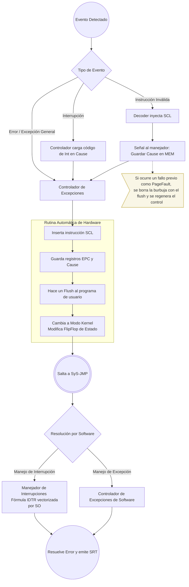

# ⚡ Flujo de Excepciones e Interrupciones (Ciclo de Vida)

Este documento describe el ciclo de vida completo de un error, excepción de memoria o interrupción de hardware, desde que es detectado físicamente por el datapath hasta que es resuelto por el software del Kernel del Sistema Operativo.

## Notas y Decisiones Claves de Hardware

* **Enrutamiento Centralizado:** Todos los errores (Page Faults, OP Codes Inválidos) e interrupciones de pines externos convergen hacia un único **Controlador de Excepciones** unificado en hardware.
* **Ausencia de Registro IDTR:** El registro `IDTR` se eliminó en el hardware. El cálculo vectorial para localizar las rutinas específicas de interrupción se realiza **completamente por software** tras delegar el control.
* **Gestión de Carga de EPC:** Al ocurrir un fallo, el Kernel es responsable de evaluar (leyendo la causa) si la dirección del *Exception Program Counter* (EPC) guardada debe incrementarse en +4 o mantenerse igual para un reintento. El hardware siempre captura el EPC desde la etapa MEM en el momento del fallo.
* **Inyección de `SCL` (Syscall):** Como respuesta inmediata a un fallo, el hardware no genera señales caóticas, sino que **inyecta dinámicamente la instrucción `SCL` en el pipeline**. Esto fuerza una interrupción de software estructurada, cambiando el privilegio y saltando al Kernel de forma segura y normalizada.

## Vectores y Excepciones por Hardware

| Vector / Cause | Tipo de Excepción | Disparador de Hardware (*Trigger*) | Comportamiento y Aislamiento del Sistema |
| :---: | :--- | :--- | :--- |
| **0** | **NOP (No Excepción)** | Estado de reposo o llamada explícita. | Usado por defecto. Al inyectar un `SCL` (SysCall), el registro Cause queda en 00. El Kernel entiende que es una SysCall limpia. |
| **1** | **Page Fault LOD / Fetch** | La MMU detecta *Not Present* o acceso denegado al Kernel leyendo instrucciones o datos. | Guarda el PC o dirección fallida en `CR2`. Evita duplicar lógica de lectura en hardware. |
| **2** | **Page Fault STR** | La MMU detecta un *Not Present*, acceso al Kernel o intento de escribir en página *Read-Only*. | Clave para detectar escrituras no permitidas, permitiendo al Kernel manejar *Copy-on-Write* o matar el proceso. |
| **3** | **General Protection Fault** | Ejecución de instrucciones privilegiadas con el bit de estado `Kernel = 0`. | Genera un Flush en el programa de usuario y evita la vulneración del espacio de memoria protegido. |
| **4** | **Invalid Opcode** | La Unidad de Control lee un patrón de bits (OpCode) que no está asignado. | Detiene la ejecución de binarios corruptos antes de causar estragos. |
| **5** | **Double Fault** | Una excepción sucede mientras el hardware aún procesaba y limpiaba un fallo previo. | Forzará al Kernel a un volcado seguro o a la detención limpia (Kernel Panic). |
| **6** | **Alignment Fault** | La ALU o controlador de memoria detecta que los últimos 2 bits de una dirección no son `00`. | Se dispara en la etapa `MEM` (para `LOD`/`STR`) o en `FETCH` (para saltos mal alineados). Evita accesos asimétricos a RAM. |

> [!IMPORTANT]
> **Distinción entre SysCalls, Excepciones e Interrupciones:**
> Cuando ocurre un salto al Kernel por `SCL` (SysCall), el hardware delega el control. 
> 1. Si el Kernel revisa el registro `Cause` y es `00`, asume que fue una llamada intencional por SysCall normal.
> 2. Si `Cause` es distinto de `00`, el Kernel revisa el **bit 31** del registro `Cause`: 
>    - Si es `0`, se trata de una Excepción síncrona (como las listadas en la tabla).
>    - Si es `1`, se trata de una Interrupción externa asíncrona (Timer, Teclado, etc.), y redirige al manejador correspondiente.

## Diagrama de Flujo (Microarquitectura a Software)

