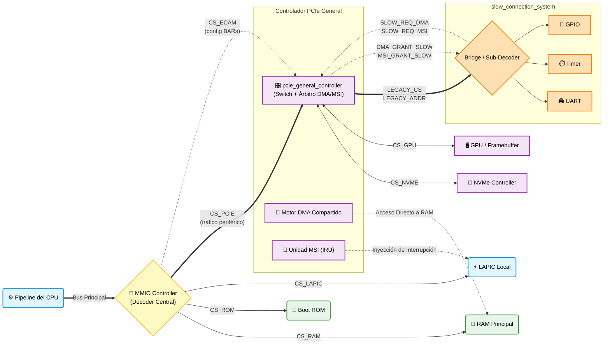

# Anotaciones de Diseño: Circuitos para el Sistema de Interconexión

> **Fecha:** 2026-06-16  
> **Referencia:** Basado en las notas del árbitro/NoC y el flujo NVMe/DMA/MSI.

A continuación se detallan las especificaciones de diseño para los cinco circuitos que componen el sistema: el **Controlador MMIO**, el **Sistema DMA**, el **Sistema MSI**, el **Puente de Periféricos Lentos** y el **Controlador PCIe General**. Cada circuito especifica sus entradas, salidas, destino de cada señal y la lógica interna que debe implementar.

---

## Índice

1. [Circuito 1 — Controlador MMIO](#circuito-1--controlador-mmio-address-decoder)
2. [Circuito 2 — Controlador y Sistema DMA](#circuito-2--controlador-y-sistema-dma-bus-master)
3. [Circuito 3 — Sistema de Conexión para Mensajes MSI](#circuito-3--sistema-de-conexión-para-mensajes-msi-iru)
4. [Circuito 4 — Puente de Periféricos Lentos](#circuito-4--puente-de-periféricos-lentos-peripheral-bridge)
5. [Circuito 5 — Controlador PCIe General](#circuito-5--controlador-pcie-general-pcie_general_controllervhd)
6. [Mapa de Memoria y Espacio ECAM](#mapa-de-memoria-y-espacio-ecam)
7. [Integración Global](#integración-de-los-tres-circuitos-en-el-sistema-global)

---

## Circuito 1 — Controlador MMIO (Address Decoder)

### Propósito

Actuar como el **"router de memoria"**. Intercepta **toda** transacción de memoria que venga del pipeline del CPU, decodifica la dirección física y decide si el acceso va a RAM, ROM, LAPIC o a un periférico (NVMe, etc.). También bloquea el bypass de caché para accesos a rangos MMIO.

> **Escalabilidad y Jerarquías:** Para soportar cientos de periféricos sin requerir cientos de salidas individuales, este controlador no se conecta directamente a cada dispositivo final. En su lugar, sus salidas `CS_PERIFn` se conectan a **Concentradores (como un PCIe Root Complex** para dispositivos rápidos) o a **Puentes/Bridges (ej. AXI-to-APB** para múltiples dispositivos lentos). El puente se encarga de la sub-decodificación, de modo que decenas de dispositivos le cuestan al MMIO central un único puerto de salida.

---

### Entradas

| ID | Señal | Ancho | Origen | Descripción |
|----|-------|-------|--------|-------------|
| E1 | `ADDR_BUS` | 32 bits | Salida de la MMU (dirección física post-traducción) | Dirección física objetivo del acceso. Es la señal principal que el decodificador de rangos analiza para decidir el destino. |
| E2 | `WDATA` | 32 bits | Registro de fuente del pipeline (etapa MEM) | El dato que el CPU quiere escribir. Viaja en paralelo con la dirección pero solo se propaga al esclavo seleccionado. |
| E3 | `WEN` | 1 bit | Unidad de Control del pipeline | Write Enable. `'1'` indica operación de escritura. |
| E4 | `REN` | 1 bit | Unidad de Control del pipeline | Read Enable. `'1'` indica operación de lectura. |
| E5 | `BYTE_SEL[3:0]` | 4 bits (strobe) | Unidad de Control / decodificador de instrucción | Indica cuáles bytes del bus de 32 bits son válidos (soporta LB, LH, LW). |
| E6 | `VALID_REQ` | 1 bit | Pipeline (etapa MEM, handshake) | El pipeline indica que `ADDR_BUS` y las señales de control son estables y representan una petición real. Parte del protocolo VALID/READY. |
| E7 | `BAR_BASE_n[31:12]` × N | 20 bits × N | Firmware/BIOS durante el arranque (vía PMIO o ECAM) | Registros internos que guardan las bases de cada región MMIO asignada. No son entradas de bus externo; se cargan en boot. |

---

### Salidas

| ID | Señal | Ancho | Destino | Descripción |
|----|-------|-------|---------|-------------|
| S1 | `CS_RAM` | 1 bit | Controlador de Memoria DRAM (DMC) | Chip Select para la RAM. Activo cuando `ADDR_BUS` cae en el rango principal (ej. `0x00000000`–`0x3FFFFFFF`). |
| S2 | `CS_ROM` | 1 bit | Módulo Flash / Boot ROM | Chip Select para la ROM. Activo en el vector de reset (ej. `0xFFFF0000`–`0xFFFFFFFF`). Solo lectura. |
| S3 | `CS_LAPIC` | 1 bit | Módulo LAPIC | Chip Select para el LAPIC local. Activo en `0xFEE00000`–`0xFEE00FFF`. |
| S5 | `CS_PERIFn` | 1 bit × N | Puerto del periférico n en el bus PCIe / NoC | Un Chip Select por cada slot de periférico registrado en los BARs. En la práctica, `CS_PCIE` es la salida principal que activa el Controlador PCIe General; solo uno activo a la vez. |
| S5b | `CS_ECAM` | 1 bit | Controlador PCIe General (`pcie_general_controller.vhd`) | Chip Select exclusivo para el rango de Configuración ECAM (`0x80000000`–`0x8000FFFF`). Indica al PCIe Controller que la transacción en curso es de configuración de BARs, no de datos. |
| S6 | `LOCAL_ADDR[19:0]` | 20 bits | El esclavo activo | Bits bajos de `ADDR_BUS` tras enmascarar la base: el offset dentro del espacio del esclavo seleccionado. |
| S7 | `WDATA_OUT[31:0]` | 32 bits | El esclavo activo (vía árbol MUX) | Dato de escritura propagado al esclavo correcto. |
| S8 | `WEN_OUT` / `REN_OUT` | 1 bit c/u | El esclavo activo | Señales de control de escritura/lectura redirigidas al módulo esclavo seleccionado. |
| S9 | `RDATA_OUT[31:0]` | 32 bits | Registro de destino del pipeline (etapa WB) | Dato devuelto por el esclavo. El árbol de MUX selecciona la salida del esclavo activo. |
| S10 | `READY` | 1 bit | Pipeline (stall / handshake READY) | Indica que la transacción se completó. `'0'` = stall si el esclavo es lento; `'1'` cuando el esclavo confirma. |
| S11 | `IS_MMIO` | 1 bit | Pipeline (etapa EX/MEM) y Caché L1-D | Bandera que indica acceso MMIO (no RAM). La caché **no** cachea el acceso; el pipeline no usa valores obsoletos. |

---

### Lógica Interna

#### Paso 1 — Decodificación de Rangos *(Combinacional)*

Para cada transacción con `VALID_REQ='1'`, se evalúan comparadores de rango sobre `ADDR_BUS[31:12]` en paralelo:

```
if   ADDR_BUS in [RAM_BASE,  RAM_TOP]         -> activa CS_RAM
elif ADDR_BUS in [ROM_BASE,  ROM_TOP]         -> activa CS_ROM
elif ADDR_BUS == 0xFEE00xxx                   -> activa CS_LAPIC
elif ADDR_BUS in [ECAM_BASE, ECAM_TOP]        -> activa CS_ECAM   -- config BARs (ECAM)
elif ADDR_BUS in [PCIE_BASE, PCIE_TOP]        -> activa CS_PCIE   -- tráfico periférico general
elif ADDR_BUS in [BAR_BASE_n, BAR_TOP_n]      -> activa CS_PERIFn -- otros periféricos adicionales
...
else -> ERROR / acceso inválido (genera excepción de bus)
```

> Solo **un** CS se activa a la vez (exclusión mutua garantizada por la estructura if-elif).

#### Paso 2 — Cálculo de Dirección Local

```
LOCAL_ADDR = ADDR_BUS XOR BAR_BASE_activo
             (equivalente: LOCAL_ADDR = ADDR_BUS[OFFSET_BITS-1:0])
```

Permite que el esclavo indexe su propia memoria interna desde `0`.

#### Paso 3 — Árbol de Multiplexores *(Enrutamiento de datos)*

- **Escritura:** `WDATA` se pasa al bus de entrada del esclavo activo. Los demás no reciben el dato (no se les activa `WEN`).
- **Lectura:** Las salidas de todos los esclavos alimentan un gran MUX controlado por los bits CS. Solo la salida del esclavo activo llega a `RDATA_OUT`.

> ⚠️ **Multiplexación vs. Tri-State:** En silicio moderno, el uso de cables eléctricos compartidos (*tri-state*) está prohibido por problemas de capacitancia y colisiones. En su lugar, se utilizan **árboles de multiplexores combinacionales**. Esto permite que las señales de cientos de periféricos se vayan "filtrando" en niveles sucesivos. El área física del circuito crece de forma logarítmica (en profundidad de niveles lógicos) y garantiza aislamiento eléctrico.

#### Paso 4 — Handshake READY/VALID

`READY` se genera combinacionalmente si el esclavo es síncrono (ROM de 1 ciclo) o con lógica secuencial (contador de espera) si el esclavo tiene latencia variable (DRAM, PCIe). El pipeline permanece en stall hasta recibir `READY='1'`.

#### Paso 5 — Flag IS_MMIO

```
IS_MMIO = NOT(CS_RAM OR CS_ROM)
```

Se envía al pipeline y al controlador de caché para suprimir el cacheado. Garantiza que cada `STR`/`LOD` a un periférico genera un acceso físico real.

---

## Circuito 2 — Controlador y Sistema DMA (Bus Master)

### Propósito

Permitir que un periférico (NVMe, GPU, tarjeta de red) lea y escriba datos directamente en la RAM sin intervención del CPU, liberando al pipeline de transferencias masivas. El DMA actúa como un **segundo maestro de bus** que compite con el CPU por el acceso al árbitro de interconexión.

> **Nota de diseño:** Se asume un DMA integrado en el NoC (estilo SoC), no un controlador externo tipo 8237. Cada periférico puede tener su propio motor DMA, o puede haber un DMA centralizado con múltiples canales.

---

### Entradas

| ID | Señal | Ancho | Origen | Descripción |
|----|-------|-------|--------|-------------|
| E1 | `DMA_REQ` | 1 bit × canal | El periférico (NVMe, GPU) | El periférico levanta esta línea para pedir permiso al árbitro del bus. Equivale al `DREQ` clásico o al *burst request* de AXI. |
| E2 | `DMA_ADDR[31:0]` | 32 bits | Registro de configuración del canal (escrito por CPU vía MMIO) | Dirección física de inicio en RAM donde el DMA debe leer/escribir. El CPU la configura antes de iniciar. |
| E3 | `DMA_LEN[19:0]` | 20 bits | Registro de configuración del canal | Número de bytes/palabras a transferir. El DMA cuenta internamente y para al llegar a cero. |
| E4 | `DMA_DIR` | 1 bit | Registro de configuración del canal | `'0'` = Periférico → RAM (NVMe deposita datos). `'1'` = RAM → Periférico (NVMe lee comandos). |
| E5 | `DMA_DATA_IN[31:0]` | 32 bits | El periférico (cuando `DMA_DIR='0'`) | Datos que el periférico quiere depositar en la RAM. |
| E6 | `BUS_GRANT` | 1 bit | Árbitro de bus (lógica de prioridad del NoC) | El árbitro confirma al DMA que puede usar el bus en este ciclo. |
| E7 | `RAM_READY` | 1 bit | Controlador de Memoria DRAM (DMC) | Handshake de la DRAM: indica que completó la operación; el DMA puede avanzar al siguiente beat. |
| E8 | `CPU_REQ` | 1 bit | Pipeline del CPU | El árbitro lo usa para saber si el CPU también quiere el bus (resolución de prioridad CPU vs DMA). |

---

### Salidas

| ID | Señal | Ancho | Destino | Descripción |
|----|-------|-------|---------|-------------|
| S1 | `DMA_ACK` | 1 bit × canal | El periférico solicitante | Confirma que la solicitud fue aceptada; el periférico puede comenzar a enviar/recibir datos. |
| S2 | `BUS_REQ` | 1 bit | Árbitro central del NoC | El controlador DMA pide el bus al árbitro central. Equivalente al `HOLD` de los DMA clásicos. |
| S3 | `RAM_ADDR[31:0]` | 32 bits | Controlador de Memoria DRAM (vía NoC) | Dirección en RAM para el siguiente acceso. Avanza automáticamente en cada beat de la ráfaga. |
| S4 | `RAM_WDATA[31:0]` | 32 bits | Controlador de Memoria DRAM | Dato a escribir en RAM (viene de `DMA_DATA_IN` cuando el periférico envía hacia RAM). |
| S5 | `RAM_WEN` | 1 bit | Controlador de Memoria DRAM | Write Enable hacia la DRAM, controlado por el DMA según `DMA_DIR`. |
| S6 | `DMA_DATA_OUT[31:0]` | 32 bits | El periférico (cuando `DMA_DIR='1'`) | Datos leídos de la RAM y entregados al periférico. |
| S7 | `DMA_DONE` | 1 bit × canal | Periférico y/o Sistema MSI | Se pulsa al terminar la transferencia completa (`DMA_LEN` llega a cero). Puede disparar una escritura MSI automática. |
| S8 | `CPU_STALL` | 1 bit | Pipeline del CPU | Se activa cuando el DMA tiene el bus y el CPU también lo necesita. El pipeline se congela hasta que el DMA lo libera. |
| S9 | `CACHE_INVALIDATE_ADDR[31:0]` | 32 bits | Controlador de caché L1-D / L2 | Cuando el DMA escribe en RAM, informa al sistema de caché para invalidar las líneas afectadas (protocolo MESI). |

---

### Lógica Interna

#### Bloque A — Árbitro de Prioridad *(Bus Arbiter)*

El DMA compite con el CPU por el bus. Política recomendada:

- **DMA tiene prioridad alta** cuando está en medio de una ráfaga (evita underrun/overrun en streaming).
- Fuera de ráfaga, el CPU tiene prioridad normal.

```
if DMA_REQ AND (BURST_IN_PROGRESS OR DMA_PRIORITY_HIGH):
    BUS_GRANT = DMA
    CPU_STALL = '1'
else if CPU_REQ:
    BUS_GRANT = CPU
    CPU_STALL = '0'
```

> Esta lógica vive dentro del NoC central y se conecta al DMA mediante `BUS_REQ` / `BUS_GRANT`.

#### Bloque B — FSM del Canal DMA *(Secuencial)*

```
┌─────────────────────────────────────────────────────────────────────┐
│  IDLE          ──► WAIT_GRANT    ──► ACTIVE_TRANSFER    ──► DONE   │
│                                                                     │
│  IDLE:                                                              │
│    Espera DMA_REQ. Al llegar:                                       │
│      CURRENT_ADDR ← DMA_ADDR                                        │
│      BEAT_COUNT   ← DMA_LEN                                         │
│      Levanta BUS_REQ                                                │
│                                                                     │
│  WAIT_GRANT:                                                        │
│    Espera BUS_GRANT='1'. El periférico aún no recibe ACK.           │
│                                                                     │
│  ACTIVE_TRANSFER:                                                   │
│    Pone CURRENT_ADDR en RAM_ADDR.                                   │
│    Si DMA_DIR='0' (Periférico→RAM):                                 │
│      activa RAM_WEN, propaga DMA_DATA_IN a RAM_WDATA.               │
│    Si DMA_DIR='1' (RAM→Periférico):                                 │
│      desactiva RAM_WEN, lee RAM y propaga dato a DMA_DATA_OUT.      │
│    En cada RAM_READY:                                               │
│      CURRENT_ADDR += 4                                              │
│      BEAT_COUNT   -= 1                                              │
│                                                                     │
│  DONE (cuando BEAT_COUNT == 0):                                     │
│    Pulsa DMA_DONE.                                                  │
│    Libera BUS_REQ (devuelve el bus).                                │
│    Pulsa CACHE_INVALIDATE_ADDR si DMA_DIR='0'.                      │
│    Vuelve a IDLE.                                                   │
└─────────────────────────────────────────────────────────────────────┘
```

#### Bloque C — Coherencia de Caché

En cada beat donde el DMA escribe en RAM (`DMA_DIR='0'`), `CURRENT_ADDR` se envía al controlador de caché como `CACHE_INVALIDATE_ADDR`. El controlador compara con las etiquetas de sus líneas y, si hay coincidencia, marca la línea como **INVALID** (protocolo MESI). Garantiza que la próxima lectura del CPU vaya a la RAM (datos frescos del DMA) y no a la caché (datos obsoletos).

---

## Circuito 3 — Sistema de Conexión para Mensajes MSI (IRU)

*MSI Translation / Interrupt Routing Unit*

### Propósito

Interceptar escrituras de memoria que son técnicamente **MSI** (*Message Signaled Interrupts*) y redirigirlas al controlador de interrupciones correcto (LAPIC del núcleo destino) en lugar de dejarlas ir a la RAM.

> Una MSI es simplemente una **escritura estándar de 32 bits** hacia la dirección `0xFEE00000` (x86) con un valor de vector especial. Este circuito es el que distingue esa escritura de una escritura RAM normal.

---

### Entradas

| ID | Señal | Ancho | Origen | Descripción |
|----|-------|-------|--------|-------------|
| E1 | `MSI_WRITE_ADDR[31:0]` | 32 bits | Árbitro/NoC central | Dirección de destino de cualquier transacción de escritura en el bus (CPU o DMA/periférico). Si cae en `0xFEE00000`–`0xFEEFFFFF`, la transacción es capturada. |
| E2 | `MSI_WRITE_DATA[31:0]` | 32 bits | El periférico/maestro de bus que genera la MSI | El "Vector de Interrupción" codificado como dato de memoria estándar. Incluye número de vector IRQ y bits de control (Edge/Level, Delivery Mode, etc.). |
| E3 | `MSI_WRITE_VALID` | 1 bit | Árbitro/NoC (handshake del canal de escritura) | Indica que `MSI_WRITE_ADDR` y `MSI_WRITE_DATA` son válidos y representan una transacción real. |
| E4 | `DEVICE_ID[N:0]` | N+1 bits (sideband) | Hardware del bus (PCIe Root Complex / NoC fabric) | Identifica **de forma inviolable** qué dispositivo generó la transacción. En PCIe se deriva del BDF (Bus:Device:Function). No puede ser falsificado por software. |
| E5 | `MSI_TABLE_ENTRY[DeviceID]` | Tabla interna | SO durante la inicialización del driver | Tabla RAM pequeña interna. Cada entrada almacena: `MSI_TARGET_LAPIC_ID`, `MSI_VECTOR`, `MSI_DELIVERY_MODE`, `MSI_MASKED`. El SO la configura vía MMIO. |

---

### Salidas

| ID | Señal | Ancho | Destino | Descripción |
|----|-------|-------|---------|-------------|
| S1 | `MSI_CAPTURE` | 1 bit | Árbitro/NoC central | Se activa cuando el módulo detecta una MSI válida. Le dice al NoC que **no** envíe esta escritura a la RAM; el módulo la ha capturado (*snoop hit*). |
| S2 | `LAPIC_INT_REQ` | 1 bit × LAPIC | Puerto de interrupción del LAPIC del núcleo destino | Inyecta la interrupción en el LAPIC correcto. El LAPIC destino se determina desde `MSI_TARGET_LAPIC_ID` de la tabla interna. |
| S3 | `LAPIC_VECTOR[7:0]` | 8 bits | LAPIC del núcleo destino | Número de vector de interrupción (0–255) que el LAPIC presentará al pipeline. Extraído de `MSI_WRITE_DATA` o de la tabla interna. |
| S4 | `LAPIC_DELIVERY_MODE[2:0]` | 3 bits | LAPIC | Modo de entrega: Fixed, SMI, NMI, INIT, ExtINT. Viene de la tabla MSI interna. |
| S5 | `MSI_ACK` | 1 bit | Periférico / maestro de bus que generó la MSI | Confirma al periférico que la MSI fue recibida y procesada. El periférico puede liberar su buffer de mensaje. |
| S6 | `MSI_ERROR` | 1 bit | Unidad de Control / registro de estado del sistema | Se activa si la escritura MSI no coincide con ninguna entrada válida o si el `DEVICE_ID` no tiene permiso para ese vector. Puede disparar una excepción al SO. |

---

### Lógica Interna

#### Paso 1 — Vigilancia del Bus *(Snoop Combinacional)*

El módulo monitorea continuamente `MSI_WRITE_ADDR` en el bus:

```
if MSI_WRITE_ADDR[31:20] == 0xFEE   // rango MSI de x86
   AND MSI_WRITE_VALID == '1':
    MSI_CAPTURE = '1'
    // El árbitro/NoC NO rutea esta escritura a la RAM
```

#### Paso 2 — Lookup en Tabla MSI *(Secuencial, 1–2 ciclos)*

Usando `DEVICE_ID` como índice:

```
TARGET_LAPIC = MSI_TABLE_ENTRY[DEVICE_ID].MSI_TARGET_LAPIC_ID
VECTOR       = MSI_TABLE_ENTRY[DEVICE_ID].MSI_VECTOR
DELIVERY     = MSI_TABLE_ENTRY[DEVICE_ID].MSI_DELIVERY_MODE
MASKED       = MSI_TABLE_ENTRY[DEVICE_ID].MSI_MASKED

if MASKED == '1':
    // Interrupción enmascarada; guardar como "pending"
    // No se propaga hasta que se desenmascara
```

#### Paso 3 — Validación de Seguridad

Se verifica que:
- `DEVICE_ID` exista en la tabla (entrada válida).
- El vector en `MSI_WRITE_DATA` coincida con el esperado en la tabla.  
  *(Evita que un dispositivo "secuestre" el vector de otro).*

```
if NOT(entry_valid) OR (MSI_WRITE_DATA.vector != VECTOR):
    MSI_ERROR = '1'
    // No se genera interrupción
```

#### Paso 4 — Despacho al LAPIC *(Secuencial)*

Con `TARGET_LAPIC` determinado, el módulo:
1. Activa `LAPIC_INT_REQ` del núcleo destino.
2. Presenta `LAPIC_VECTOR` y `LAPIC_DELIVERY_MODE` en el bus del LAPIC.
3. La FSM espera el ACK del LAPIC antes de emitir `MSI_ACK` al periférico.

#### Paso 5 — Handshake de Completado

```
// Una vez que el LAPIC confirma recepción:
MSI_ACK = '1'  // pulso de 1 ciclo
```

Esto cierra el ciclo de escritura del periférico. El periférico sabe que su interrupción fue entregada al sistema y libera su buffer MSI.

---

## Circuito 4 — Puente de Periféricos Lentos (Peripheral Bridge)

### Propósito

Implementar de forma práctica la jerarquía de buses descrita en el Controlador MMIO. Un puente (*Bridge*) recibe un único Chip Select desde el MMIO principal y realiza una **sub-decodificación** para controlar múltiples periféricos de baja velocidad (UART, Timers, GPIO) sin sobrecargar de puertos al árbitro central. Actúa como un sub-árbitro o embudo para dispositivos pequeños.

---

### Entradas (desde el Controlador PCIe General)

> ⚠️ **Cambio de conexión:** Las entradas de este puente **ya no provienen del `mmio_controller.vhd`**. Ahora se conectan a los puertos de salida dedicados `LEGACY_CS` y `LEGACY_ADDR` que deben crearse en el `pcie_general_controller.vhd`. El MMIO central deja de ver a los dispositivos lentos directamente; en su lugar, el Controlador PCIe actúa como intermediario y enruta el tráfico cuando detecta que la dirección corresponde al rango de dispositivos lentos.

| Señal | Ancho | Origen | Descripción |
|-------|-------|--------|-------------|
| `LEGACY_CS` | 1 bit | Puerto de salida `LEGACY_CS` del `pcie_general_controller.vhd` | Chip Select principal asignado a este puente. Activo cuando el Controlador PCIe determina que la dirección cae en el rango de periféricos lentos. Reemplaza al antiguo `CS_BRIDGE` que venía del MMIO. |
| `LEGACY_ADDR[19:0]` | 20 bits | Puerto de salida `LEGACY_ADDR` del `pcie_general_controller.vhd` | Offset enviado por el Controlador PCIe tras enmascarar la base del rango legacy. El puente usa los bits superiores (ej. `[19:16]`) para sub-decodificar el periférico destino. Reemplaza al antiguo `LOCAL_ADDR` del MMIO. |
| `WDATA_IN`, `WEN`, `REN` | 32 y 1 bit | Controlador PCIe General | Señales de escritura/lectura y datos propagados desde el Controlador PCIe al sub-periférico activo. |
| `RDATA_Px`, `READY_Px` | 32 y 1 bit | Sub-periféricos conectados (UART, Timer, etc.) | Datos y handshake de respuesta provenientes de cada sub-periférico. |
| `SLOW_REQ_DMA` | 1 bit | Periférico lento que solicita transferencia DMA | Señal con la que el puente lento le pide permiso a la FSM del PCIe para iniciar una transmisión DMA. El Controlador PCIe decide cuándo concederla según su estado interno. |
| `SLOW_REQ_MSI` | 1 bit | Periférico lento que genera una interrupción | Señal con la que el puente lento solicita al Controlador PCIe el uso del canal MSI compartido. El PCIe arbitra el acceso y lo enruta hacia la IRU. |

---

### Salidas (hacia sub-periféricos y Controlador PCIe)

| Señal | Ancho | Descripción |
|-------|-------|-------------|
| `CS_UART`, `CS_TIMER`, etc. | 1 bit c/u | Chip Selects locales para cada sub-periférico. Se activan solo si `LEGACY_CS` es `'1'` y los bits de sub-decodificación coinciden. |
| `SUB_ADDR[15:0]` | 16 bits | Offset local propagado al sub-periférico (bits bajos de `LEGACY_ADDR`). |
| `RDATA_BRIDGE` | 32 bits | Retorno hacia el Controlador PCIe General, que a su vez lo reenvía al MUX del MMIO. Proviene del árbol de MUX interno del puente. |
| `READY_BRIDGE` | 1 bit | Retorno hacia el Controlador PCIe indicando que el sub-periférico lento terminó su operación. |

---

### Lógica Interna

1. **Sub-decodificación Combinacional:** 
   Se inspeccionan los bits `LEGACY_ADDR[19:16]`. 
   - Si `0000` -> activa `CS_UART` (condicionado por `LEGACY_CS == 1`)
   - Si `0001` -> activa `CS_TIMER` (condicionado por `LEGACY_CS == 1`)
2. **Árbol MUX Secundario:** 
   Las salidas `RDATA` de los periféricos lentos entran a un MUX local de menor escala controlado por los `CS` locales. Su salida unificada alimenta la señal `RDATA_BRIDGE` que vuelve al MMIO.
   
> **Conclusión en Hardware:** Este cuarto circuito demuestra físicamente cómo el sistema no crece de forma lineal y cómo el diseño modular permite conectar decenas de dispositivos de I/O ocupando tan solo **un** puerto en el MMIO central.

---
## Circuito 5 — Controlador PCIe General (`pcie_general_controller.vhd`)

### Propósito

Actuar como el **switch central de periféricos**, absorbiendo el tráfico que el MMIO le delega mediante `CS_PERIFn` y ruteándolo hacia el destino correcto: NVMe, GPU, o el conjunto de dispositivos lentos a través del `slow_connection_system.vhd`. Además, arbitra las solicitudes de DMA y MSI provenientes de los periféricos lentos, controlando cuándo se les concede acceso a los recursos compartidos del sistema.

> Este componente expande la lógica que antes era implícita en el "Complejo PCIe" del diagrama global, formalizándola como un módulo VHDL con puertos y FSM propios.

---

### Entradas

| Señal | Ancho | Origen | Descripción |
|-------|-------|--------|-------------|
| `CS_PCIE` | 1 bit | MMIO Controller (`CS_PERIFn`) | Chip Select general que habilita al Controlador PCIe. Activo cuando el MMIO determina que la dirección cae en el rango PCIe/periféricos. |
| `LOCAL_ADDR[19:0]` | 20 bits | MMIO Controller | Offset dentro del espacio PCIe. El Controlador PCIe inspecciona estos bits para determinar si el destino es NVMe, GPU o el rango legacy de dispositivos lentos. |
| `WDATA_IN[31:0]` | 32 bits | MMIO Controller | Dato de escritura propagado desde el CPU. |
| `WEN`, `REN` | 1 bit c/u | MMIO Controller | Señales de control de lectura/escritura. |
| `SLOW_REQ_DMA` | 1 bit | `slow_connection_system.vhd` | Petición del puente lento para usar el canal DMA compartido. La FSM del PCIe concede o pospone el acceso. |
| `SLOW_REQ_MSI` | 1 bit | `slow_connection_system.vhd` | Petición del puente lento para enviar una MSI a través del sistema de interrupciones compartido. |
| `RDATA_NVME[31:0]`, `READY_NVME` | 32 y 1 bit | NVMe Controller | Respuesta del NVMe ante lecturas o handshakes de completado. |
| `RDATA_GPU[31:0]`, `READY_GPU` | 32 y 1 bit | GPU Controller | Respuesta de la GPU. |
| `RDATA_BRIDGE[31:0]`, `READY_BRIDGE` | 32 y 1 bit | `slow_connection_system.vhd` | Respuesta consolidada del puente lento. |

---

### Salidas

| Señal | Ancho | Destino | Descripción |
|-------|-------|---------|-------------|
| `CS_NVME` | 1 bit | NVMe Controller | Chip Select hacia el NVMe. Activo cuando `LOCAL_ADDR` cae en el sub-rango asignado al NVMe. |
| `CS_GPU` | 1 bit | GPU Controller | Chip Select hacia la GPU. Activo cuando `LOCAL_ADDR` cae en el sub-rango de la GPU. |
| `LEGACY_CS` | 1 bit | `slow_connection_system.vhd` | **Puerto nuevo.** Chip Select de propagación hacia el puente lento. Reemplaza la conexión directa que antes existía entre el `mmio_controller` y el `slow_connection_system`. Se activa cuando la dirección cae en el rango legacy. |
| `LEGACY_ADDR[19:0]` | 20 bits | `slow_connection_system.vhd` | **Puerto nuevo.** Offset enmascarado propagado al puente lento. Equivale al `LOCAL_ADDR` que el MMIO antes enviaba directamente al puente. |
| `WDATA_OUT[31:0]` | 32 bits | NVMe / GPU / `slow_connection_system` | Dato de escritura enrutado al dispositivo seleccionado. |
| `WEN_OUT`, `REN_OUT` | 1 bit c/u | Dispositivo seleccionado | Señales de control propagadas al destino activo. |
| `RDATA_OUT[31:0]` | 32 bits | MMIO Controller (MUX de lectura) | Dato de retorno seleccionado mediante árbol MUX interno entre las respuestas de NVMe, GPU y puente lento. |
| `READY_OUT` | 1 bit | MMIO Controller (handshake) | Handshake de completado consolidado. Se genera cuando el dispositivo seleccionado confirma su `READY`. |
| `DMA_GRANT_SLOW` | 1 bit | `slow_connection_system.vhd` | Confirmación de que el DMA está disponible para el periférico lento. La FSM lo activa cuando no hay otra transferencia en curso. |
| `MSI_GRANT_SLOW` | 1 bit | `slow_connection_system.vhd` | Permiso para que el periférico lento inyecte su MSI en el canal compartido. |

---

### Lógica Interna

#### Bloque A — Decodificación de Sub-Rango *(Combinacional)*

Con `CS_PCIE='1'`, el controlador evalúa `LOCAL_ADDR` para determinar el destino:

```
if   LOCAL_ADDR in [NVME_OFFSET_BASE, NVME_OFFSET_TOP]   -> activa CS_NVME
elif LOCAL_ADDR in [GPU_OFFSET_BASE,  GPU_OFFSET_TOP]    -> activa CS_GPU
elif LOCAL_ADDR in [LEGACY_OFFSET_BASE, LEGACY_OFFSET_TOP] -> activa LEGACY_CS
else -> error de bus (dirección no mapeada dentro del espacio PCIe)
```

Solo un destino se activa a la vez. `LEGACY_ADDR` se calcula enmascarando la base del rango legacy, igual que el MMIO calcula `LOCAL_ADDR`.

#### Bloque B — FSM de Arbitraje de Recursos Compartidos *(Secuencial)*

La FSM gestiona el acceso de los periféricos lentos al DMA y al MSI:

```
┌──────────────────────────────────────────────────────────────────┐
│  IDLE  ──► GRANT_DMA  ──► WAIT_DMA_DONE  ──► IDLE              │
│        ──► GRANT_MSI  ──► WAIT_MSI_ACK   ──► IDLE              │
│                                                                  │
│  IDLE:                                                           │
│    Si SLOW_REQ_DMA='1' y bus DMA libre:                          │
│      DMA_GRANT_SLOW='1' -> estado GRANT_DMA                      │
│    Si SLOW_REQ_MSI='1' y canal MSI libre:                        │
│      MSI_GRANT_SLOW='1' -> estado GRANT_MSI                      │
│                                                                  │
│  GRANT_DMA / GRANT_MSI:                                          │
│    Espera confirmación de completado (DMA_DONE / MSI_ACK).       │
│    Baja la señal de GRANT y regresa a IDLE.                      │
└──────────────────────────────────────────────────────────────────┘
```

#### Bloque C — Árbol MUX de Retorno *(Combinacional)*

Las respuestas de NVMe, GPU y el puente lento ingresan a un MUX controlado por los CS activos:

```
RDATA_OUT = CS_NVME   ? RDATA_NVME  :
            CS_GPU    ? RDATA_GPU   :
            LEGACY_CS ? RDATA_BRIDGE :
                        32'h00000000
READY_OUT = CS_NVME   ? READY_NVME  :
            CS_GPU    ? READY_GPU   :
            LEGACY_CS ? READY_BRIDGE :
                        '0'
```

---

## Mapa de Memoria y Espacio ECAM

### Estrategia ECAM (*Enhanced Configuration Access Mechanism*)

En lugar de agregar cables físicos adicionales para distinguir tráfico de configuración del tráfico de datos, el sistema adopta el mecanismo estándar PCIe: **ECAM**. Este enfoque reserva un rango de direcciones de memoria exclusivo para acceder al espacio de configuración de los dispositivos (BARs, capacidades, etc.), usando exactamente los mismos cables ya presentes en la jerarquía.

El MMIO Controller reconoce ese rango y lo trata de forma especial: las escrituras a esas direcciones configuran los registros internos de los dispositivos, no depositan datos en RAM ni en buffers de periférico.

### Mapa de Direcciones del Sistema

| Rango de Direcciones | Tamaño | Destino | Notas |
|----------------------|--------|---------|-------|
| `0x00000000` – `0x3FFFFFFF` | 1 GiB | RAM Principal | Acceso normal de lectura/escritura. CS_RAM activo. |
| `0x40000000` – `0x4FFFFFFF` | 256 MiB | Tráfico PCIe normal | Escrituras a GPU, NVMe, etc. Enrutado vía `CS_PCIE` → `pcie_general_controller`. |
| `0x80000000` – `0x8000FFFF` | 64 KiB | Espacio de Configuración (BARs) — ECAM | Reservado. Accesos a este rango configuran los BARs y registros de capacidad de los dispositivos PCIe. No se rutean a RAM. |
| `0xFEE00000` – `0xFEEFFFFF` | 1 MiB | LAPIC / MSI | Interceptado por la IRU (Circuito 3). Nunca llega a RAM. |
| `0xFFFF0000` – `0xFFFFFFFF` | 64 KiB | Boot ROM | Solo lectura. CS_ROM activo en vector de reset. |

> **Implementación VHDL:** Para soportar ECAM sin cables adicionales, el MMIO Controller debe agregar una rama en su decodificador de rangos (Paso 1 de la lógica interna) que active una señal `CS_ECAM` para el rango `0x80000000`–`0x8000FFFF`. Esta señal se conecta al `pcie_general_controller`, que la usa para distinguir si la transacción en curso es de configuración (ajusta BARs internos) o de datos (la enruta normalmente).

---


```
[CPU Pipeline]
     │  ADDR_BUS, WDATA, WEN, REN, VALID_REQ
     ▼
[CONTROLADOR MMIO] ──────────► CS_RAM    ──► [DRAM Controller]
     │               ─────────► CS_ROM    ──► [Boot ROM]
     │               ─────────► CS_LAPIC  ──► [LAPIC]
     │               ─────────► CS_ECAM   ──► [PCIe General Controller] (config BARs)
     │               ═════════► CS_PCIE   ══► [PCIe GENERAL CONTROLLER]
     │  READY, RDATA_OUT ◄───── (respuestas de esclavos vía MUX)
     │  IS_MMIO ──────────────► [Caché L1-D]  (suprime caching)
     │
     ▼
[PCIe GENERAL CONTROLLER]
     ├──────────────────────────► CS_NVME  ──► [NVMe Controller]
     ├──────────────────────────► CS_GPU   ──► [GPU Controller]
     ├── LEGACY_CS, LEGACY_ADDR ─────────────► [SLOW CONNECTION SYSTEM]
     │       ◄── SLOW_REQ_DMA, SLOW_REQ_MSI ── (peticiones del puente lento)
     │       ──► DMA_GRANT_SLOW, MSI_GRANT_SLOW (permisos concedidos)
     │
     ▼
[ÁRBITRO DE BUS / NoC]
     ▲              ▲
     │              │
[CPU Pipeline]  [CONTROLADOR DMA] ◄─── DMA_REQ, Config (de CPU vía MMIO)
                     │
                     ├── RAM_ADDR, RAM_WEN, RAM_WDATA ──► [DRAM Controller]
                     ├── CACHE_INVALIDATE_ADDR ─────────► [Caché L1-D]
                     ├── DMA_DONE ───────────────────────► [Sistema MSI]  (trigger)
                     └── CPU_STALL ──────────────────────► [CPU Pipeline]
                     │
              (Al terminar, NVMe genera escritura MSI)
                     │
                     ▼
[SISTEMA MSI / IRU]
     ├── MSI_CAPTURE ──────► [NoC]                  (bloquea escritura a RAM)
     ├── LAPIC_INT_REQ ────► [LAPIC del núcleo destino]
     ├── LAPIC_VECTOR ─────► [LAPIC]
     ├── MSI_ACK ──────────► [NVMe / periférico]
     └── MSI_ERROR ────────► [Registro de estado / excepción del SO]
```

### Árbitro de Bus (NoC) y Controlador de Memoria (DMC)

El Árbitro o Red en Chip (NoC) resuelve el problema de tener múltiples maestros y cientos de dispositivos interactuando simultáneamente:
- **Canales Compartidos y Arbitraje:** Los dispositivos no requieren conexiones físicas paralelas dedicadas para cada uno. Comparten los mismos cables del bus central divididos en canales multiplexados en el tiempo. El flujo se ordena mediante señales de *handshake* (`VALID`/`READY`) en cada ciclo de reloj.
- **El DMC como embudo final:** El Controlador de Memoria (DRAM) sí es un punto de congestión, pero no por el número de cables, sino por el ancho de banda. Toda la multitud de periféricos y DMA ya ha sido arbitrada y filtrada por el NoC antes de llegar al DMC. Por ende, el DMC no necesita miles de pines de entrada; solo ve una única cola ordenada de peticiones de alta velocidad.

### Flujo completo de una operación NVMe (resumen de integración)

| Paso | Quién actúa | Qué hace | Circuito involucrado |
|------|-------------|----------|----------------------|
| 1 | CPU | Escribe en el *Doorbell* del NVMe | **MMIO** → `CS_PCIE` → **PCIe Controller** → `CS_NVME` |
| 2 | NVMe | Pide el bus y lee el comando de la RAM por DMA | **DMA** → `BUS_REQ` / `BUS_GRANT` |
| 3 | NVMe | Busca datos en NAND y los escribe en RAM por DMA | **DMA** → `RAM_ADDR`, `RAM_WEN` |
| 4 | DMA | Invalida líneas de caché afectadas | **DMA** → `CACHE_INVALIDATE_ADDR` |
| 5 | NVMe | Escribe estado en cola de finalización por DMA | **DMA** → `DMA_DONE` |
| 6 | NVMe | Genera escritura MSI hacia `0xFEE00000` | **MSI/IRU** → `MSI_CAPTURE` → `LAPIC_INT_REQ` |
| 7 | LAPIC | Lanza la interrupción al pipeline del CPU | Pipeline atiende el *handler* del SO |

---

## Diagrama Lógico de Interconexión del Sistema

A continuación se presenta un diagrama global que refleja la jerarquía y conexión de los circuitos diseñados:

