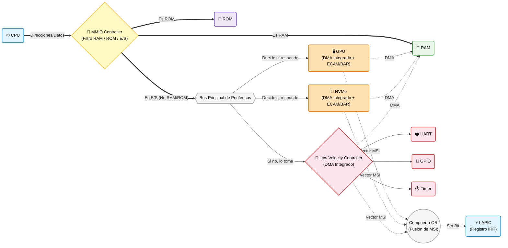

# Especificación de Circuitos: Arquitectura MMIO Simplificada (Dos Circuitos)

> **Referencia:** Diseño ultra-simplificado basado en enrutamiento directo y decodificación distribuida.
> **Estado:** El sistema se compone de solo dos circuitos dedicados explícitamente a la gestión de E/S: el **MMIO Controller** y el **Low Velocity Controller**. La inteligencia de decodificación recae sobre los propios dispositivos finales.

---

## 1. Circuito 1 — MMIO Controller (Filtro Principal)

### Propósito
Actuar como el divisor o barrera entre la memoria principal (RAM), la memoria de solo lectura (ROM) y el resto del sistema (E/S). Su función es clasificar y enrutar las peticiones según la dirección de memoria.

### Lógica Interna y Funcionamiento
*   **Filtro RAM / ROM vs. MMIO:** Analiza la dirección solicitada por la CPU.
    *   Si la dirección pertenece a la RAM, enruta la petición directamente hacia ella.
    *   Si la dirección pertenece a la ROM, enruta la petición hacia el chip/bloque de la ROM.
    *   Si **no** es RAM ni ROM, el controlador "tira" la señal hacia afuera, exponiéndola en el bus de periféricos al que están conectados directamente los dispositivos de alta velocidad (PCIe) y el circuito de baja velocidad.
*   **Decodificación Distribuida:** El MMIO Controller *no* calcula *Chip Selects* para periféricos individuales (`CS_GPU`, `CS_NVME`, etc.), solo gestiona las habilitaciones para la RAM y la ROM. Las direcciones destinadas a periféricos fluyen por el bus; son los propios dispositivos PCIe los que inspeccionan el bus de forma continua y **deciden si responden o no**, basándose en sus propios comparadores internos (BARs).

---

## 2. Circuito 2 — Low Velocity Controller (LVC)

### Propósito
Agrupar y gestionar los periféricos lentos (UART, GPIO, Timers) que no poseen la complejidad suficiente para actuar como dispositivos autónomos en el bus principal.

### Lógica Interna y Funcionamiento
*   **Receptor y Mapeo Directo:** Si los dispositivos PCIe no reclaman la transacción (o al escuchar el bus compartido), las señales llegan a este segundo circuito. El LVC toma las direcciones, las mapea directamente contra sus rangos internos predefinidos y **decide si responde o no**. Si coincide, enruta la petición al sub-periférico específico (ej. UART).
*   **Motor DMA Integrado:** Dado que los periféricos lentos son simples y carecen de masterización de bus, el LVC contiene un motor DMA compartido. A través de este motor, gestiona las transferencias directas a memoria en nombre del UART o GPIO.

---

## Mecanismos Globales del Sistema (ECAM, DMA, MSI)

En esta topología minimalista, los mecanismos del sistema se resuelven de la siguiente manera:

1.  **ECAM (Mecanismo de Configuración):** 
    La ventana de memoria ECAM está presente. Puesto que el MMIO Controller filtra solo RAM y ROM, el tráfico dirigido al rango ECAM sale al bus de periféricos. Los endpoints PCIe tienen integrada la lógica para interpretar la fórmula de enrutamiento implícito (BDF) de esta ventana y configurar sus propios registros BAR en consecuencia durante el arranque.
2.  **Motores DMA Independientes:**
    No hay un controlador DMA central masivo. 
    *   Cada PCIe (GPU, NVMe) **tiene su propio motor DMA** integrado.
    *   El **Low Velocity Controller** aporta el motor DMA para los periféricos lentos.
    *   Todos dirigen sus peticiones directamente hacia el bus de memoria para acceder a la RAM.
3.  **MSI (Interrupciones Directas al LAPIC):**
    Las interrupciones (MSI) de todos los dispositivos (GPU, NVMe, LVC) se gestionan como escrituras de un vector. Estas peticiones viajan físicamente y convergen en una **Compuerta Lógica OR**. Esta compuerta unifica las señales eléctricas y actualiza de forma combinacional y directa el registro IRR del LAPIC, evitando por completo cuellos de botella o necesidad de FIFOs en una IRU central.

---

## Diagrama Lógico de Interconexión del Sistema

