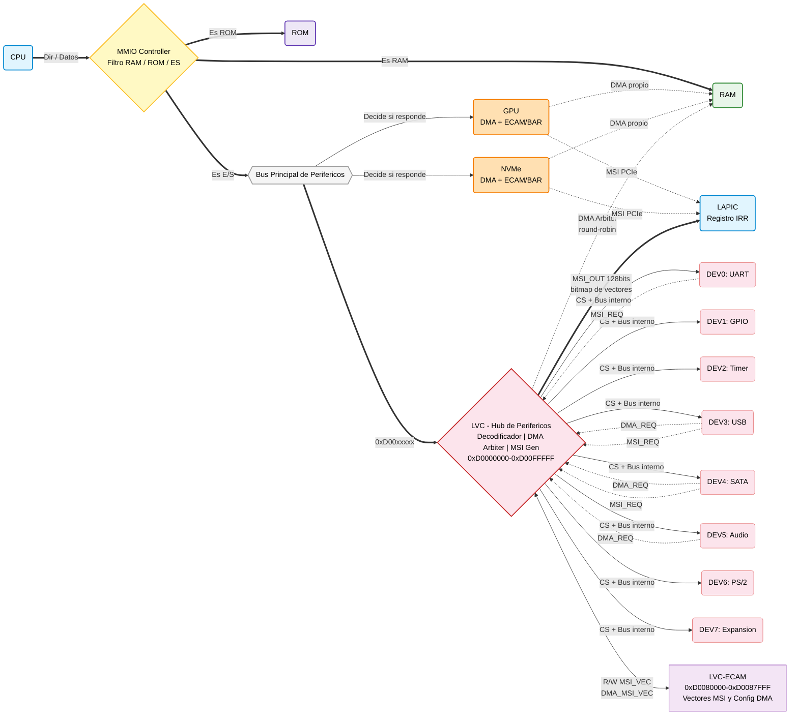

# Especificación de Circuitos: Arquitectura MMIO Simplificada (Dos Circuitos)

> **Referencia:** Diseño basado en enrutamiento directo, decodificación centralizada en el LVC y MSI de 128 bits.
> **Estado:** El sistema se compone de dos circuitos de interconexión: el **MMIO Controller** (filtro RAM/ROM/E/S) y el **Low Velocity Controller** (hub de periféricos tipo PCIe-switch). El LVC centraliza toda la decodificación de sub-rangos, el arbitraje DMA y la generación del bitmap MSI de 128 bits.

---

## 1. Circuito 1 — MMIO Controller (Filtro Principal)

### Propósito
Actuar como el divisor o barrera entre la memoria principal (RAM), la memoria de solo lectura (ROM) y el resto del sistema (E/S). Su función es clasificar y enrutar las peticiones según la dirección de memoria.

### Lógica Interna y Funcionamiento
*   **Filtro RAM / ROM vs. MMIO:** Analiza la dirección solicitada por la CPU.
    *   Si la dirección pertenece a la RAM, enruta la petición directamente hacia ella.
    *   Si la dirección pertenece a la ROM, enruta la petición hacia el chip/bloque de la ROM.
    *   Si **no** es RAM ni ROM, el controlador "tira" la señal hacia afuera, exponiéndola en el bus de periféricos al que están conectados directamente los dispositivos de alta velocidad (PCIe) y el circuito de baja velocidad.
*   **Decodificación Distribuida:** El MMIO Controller *no* calcula *Chip Selects* para periféricos individuales (`CS_GPU`, `CS_NVME`, etc.), solo gestiona las habilitaciones para la RAM y la ROM. Las direcciones destinadas a periféricos fluyen por el bus; son los propios dispositivos PCIe los que inspeccionan el bus de forma continua y **deciden si responden o no**, basándose en sus propios comparadores internos (BARs).

---

## 2. Circuito 2 — Low Velocity Controller (LVC)

### Propósito
Actuar como un **hub de periféricos tipo PCIe-switch simplificado** para interfaces lentas (UART, GPIO, Timer, USB, SATA, Audio, PS/2 y futuras expansiones). El LVC centraliza tres responsabilidades que en un sistema PCIe estándar estarían distribuidas entre los propios dispositivos:
1. **Decodificación de direcciones** — determina a qué dispositivo va cada transacción.
2. **Arbitraje DMA** — gestiona las transferencias a RAM de todos los dispositivos conectados.
3. **Generación del bitmap MSI** — agrupa las peticiones de interrupción en un vector de 128 bits.

### Lógica Interna y Funcionamiento

#### A. Decodificación Centralizada de Direcciones
*   El LVC detecta cuando los bits `[31:20]` de la dirección son `0xD00` (su rango global `0xD0000000–0xD00FFFFF`).
*   Dentro de ese rango distingue dos zonas usando el bit `[19]`:
    *   **`[19]=0` → MMIO de dispositivo** (`0xD0000000–0xD007FFFF`): los bits `[18:12]` seleccionan el dispositivo (DEV0–DEV7). El LVC activa el `CS` del dispositivo correspondiente y expone el offset `[11:0]` en el bus interno compartido.
    *   **`[19]=1` → LVC-ECAM** (`0xD0080000–0xD00FFFFF`): los bits `[10:8]` seleccionan el dispositivo a configurar y los bits `[3:2]` el registro interno. El acceso es atendido por el banco de registros del LVC sin propagar nada al bus de dispositivos.
*   Los dispositivos conectados **no necesitan comparadores propios**: solo procesan cuando reciben su `CS` individual activado por el LVC.

#### B. Interfaz MSI por Dispositivo (1 bit entrada → 128 bits salida)
*   Cada dispositivo conectado expone una señal de 1 bit: `DEVn_MSI_REQ`.
*   Cuando `DEVn_MSI_REQ='1'` y la MSI está habilitada en el registro `MSI_CTRL` del LVC-ECAM para ese dispositivo, el LVC:
    1. Lee el **vector configurable** de 7 bits (`MSI_VEC`, rango 0–127) del registro ECAM del dispositivo.
    2. Enciende el bit correspondiente en el **bitmap de salida `MSI_OUT[127:0]`**.
*   Múltiples dispositivos pueden interrumpir simultáneamente; el LVC ORea todos los bits activos en un único vector de 128 bits.
*   El motor DMA también genera su propia MSI de finalización usando un vector independiente (`DMA_MSI_VEC`) por dispositivo, también configurable vía ECAM.

#### C. Interfaz DMA por Dispositivo
*   Cada dispositivo puede solicitar una transferencia DMA con las siguientes señales:

    | Señal | Dirección | Descripción |
    |---|---|---|
    | `DEVn_DMA_REQ` | Dev→LVC | Solicita el bus DMA |
    | `DEVn_DMA_WE` | Dev→LVC | 1=escribir a RAM, 0=leer de RAM |
    | `DEVn_DMA_Addr[31:0]` | Dev→LVC | Dirección de inicio en RAM |
    | `DEVn_DMA_Cant[15:0]` | Dev→LVC | Cantidad de palabras de 32 bits a transferir |
    | `DEVn_DMA_GNT` | LVC→Dev | El LVC otorga el bus al dispositivo |
    | `DEVn_DMA_DONE` | LVC→Dev | Pulso de 1 ciclo: transferencia completada |
    | `DMA_Wr_Data[31:0]` | Dev→LVC | **Bus compartido**: dato a escribir en RAM |
    | `DMA_Rd_Data[31:0]` | LVC→Dev | **Bus compartido**: dato leído de RAM |
    | `DMA_Word_ACK` | LVC→All | Pulso: una palabra fue transferida (solo el dev con GNT actúa) |

*   El LVC incluye un **árbitro round-robin** que otorga el bus DMA a un solo dispositivo a la vez.
*   Al finalizar la última palabra, el LVC pulsa `DEVn_DMA_DONE='1'` y opcionalmente genera la MSI de finalización si `DMA_MSI_EN='1'` en el ECAM.

#### D. Banco de Registros LVC-ECAM
Cada dispositivo (DEV0–DEV7) tiene un bloque de configuración de 4 KB en `0xD0080000 + n*0x1000`:

| Offset | Registro | Descripción |
|---|---|---|
| `0x000` | `DEVICE_ID` *(RO)* | Identificador del dispositivo |
| `0x004` | `MSI_CTRL` | `[0]`=MSI_EN, `[1]`=DMA_MSI_EN |
| `0x008` | `MSI_VEC` | Vector MSI del dispositivo `[6:0]` (0–127) |
| `0x00C` | `DMA_MSI_VEC` | Vector MSI de finalización DMA `[6:0]` |
| `0x010` | `STATUS` *(RO)* | `[0]`=DMA_ACTIVO, `[1]`=MSI_PENDIENTE |
| `0x014–0xFFF` | Reservado | — |

---

## Mecanismos Globales del Sistema (ECAM, DMA, MSI)

En esta topología, los mecanismos del sistema se resuelven de la siguiente manera:

1.  **ECAM del Bus PCIe (Configuración de GPU/NVMe):**
    La ventana de memoria ECAM del bus principal (`0xC0000000–0xCFFFFFFF`) fluye por el bus de periféricos. Los endpoints PCIe (GPU, NVMe) tienen integrada la lógica BDF para configurar sus BARs durante el arranque.
2.  **LVC-ECAM (Configuración de dispositivos del LVC):**
    El LVC expone su propio espacio de configuración en `0xD0080000–0xD0087FFF`. El OS escribe aquí los vectores MSI y habilita las DMA-MSI de cada dispositivo. El acceso a este rango es procesado internamente por el banco de registros del LVC.
3.  **Motores DMA:**
    *   GPU y NVMe tienen **DMA propio** integrado.
    *   El LVC tiene un **árbitro DMA centralizado round-robin** para sus 8 dispositivos. Solo un dispositivo transfiere en cada momento usando el bus compartido `DMA_Wr_Data` / `DMA_Rd_Data`.
4.  **MSI de 128 bits (Bitmap de vectores):**
    Las interrupciones de los dispositivos del LVC se gestionan como un **bitmap de 128 bits**. Cada dispositivo señaliza con 1 bit (`MSI_REQ`); el LVC mapea cada señal a un vector configurable (0–127) vía ECAM y produce `MSI_OUT[127:0]`. El motor DMA también genera MSI de finalización por canal, con vector independiente. Este bitmap se envía directamente al LAPIC. La GPU y NVMe usan MSI PCIe estándar (escritura a `0xFEE00000`).

---

## Diagrama Lógico de Interconexión del Sistema

