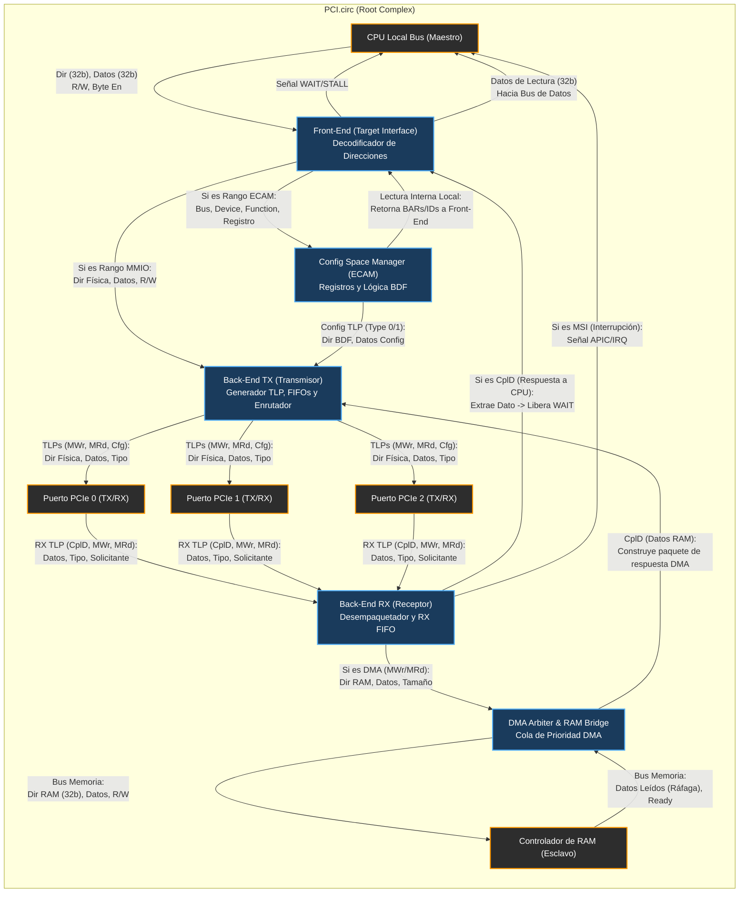

# Diseño del Root Complex (Controlador MMIO) PCI Express

Este documento detalla la organización y funciones del **Root Complex** (también conocido como Controlador MMIO) para el procesador de 32 bits, separando el control de la configuración (ECAM) del flujo de datos (TLPs).

## 1. Funciones Principales del Root Complex

### 1.1 Decodificador de Direcciones (Address Decoder)
* **Función:** Clasifica la dirección entrante de la CPU. Determina si la transacción va dirigida a RAM, ROM, espacio de configuración ECAM o si debe ser enrutada hacia uno de los 3 Puertos Raíz (Root Ports) para acceder a periféricos.

### 1.2 Gestor de Configuración (ECAM Target)
* **Función:** Mapea el rango de memoria configurado para ECAM (Enhanced Configuration Access Mechanism). Cuando la CPU escribe o lee en este rango, el controlador extrae el identificador **BDF** (Bus, Device, Function) junto con el número de registro, genera un **TLP de Configuración (Type 0 o Type 1)** y lo enruta al dispositivo correcto.
* *Nota adicional:* Genera **Type 0** para dispositivos conectados directamente a los puertos raíz y **Type 1** para dispositivos conectados detrás de switches o puentes (bridges).

### 1.3 Generador de TLPs (Transaction Layer Packetizer)
* **Función:** Traduce las operaciones de carga/almacenamiento (load/store) de la CPU en paquetes estándar de la capa de transacción de PCIe (TLPs).
* *Nota:* Para accesos a ECAM, genera paquetes de Configuración (Read/Write); para accesos MMIO, genera paquetes de Memoria (Memory Read/Write).

### 1.4 Enrutador de Puertos Raíz (Port Router)
* **Función:** Contiene los registros de **Base** y **Límite** (Memory/Prefetchable) y de **Bus Numbers** (Primary, Secondary, Subordinate) para cada uno de los 3 puertos. Compara la dirección del TLP entrante contra estos registros para decidir por qué cable físico (puerto) sale el paquete.

### 1.5 Receptor/Desempaquetador de TLPs (Depacketizer)
* **Función:** Escucha los paquetes de retorno de los periféricos, como las lecturas completadas (*Completion with Data* - CplD). Traduce el TLP de vuelta a una respuesta que la CPU pueda procesar (ej. depositando el dato crudo en el bus de datos de la CPU).

### 1.6 Arbitraje de Bus Master y DMA (Host Controller)
* **Función:** Gestiona las peticiones de los periféricos que quieren hacer **DMA** (Direct Memory Access). Recibe los TLPs de escritura y lectura de memoria originados por los dispositivos (ej. un SSD NVMe o una GPU escribiendo en RAM) y les otorga acceso al bus interno del sistema.

### 1.7 Interceptor de Interrupciones (MSI / MSI-X) *[Añadido]*
* **Función:** En PCIe, las interrupciones modernas viajan como simples **TLPs de Escritura en Memoria** (Message Signaled Interrupts) hacia una dirección física específica. El Root Complex debe interceptar estas escrituras "mágicas" y transformarlas en señales de interrupción (cables físicos) hacia el controlador de interrupciones del procesador (como un APIC o GIC).

### 1.8 Gestor de Errores (AER - Advanced Error Reporting) *[Añadido]*
* **Función:** Captura TLPs malformados, peticiones no soportadas (*Unsupported Requests*) o respuestas de error (*Completer Abort*). Si un dispositivo falla o se desconecta, el Root Complex debe generar una excepción (*fault* o *abort*) en la CPU para evitar colapsar el sistema.

---

## 2. Consideraciones Clave para el Diseño del Hardware

### 2.1 El Paradigma de Paquetes (Por qué usar TLPs)
PCIe funciona más como una red informática que como un bus tradicional. A diferencia de los buses antiguos que tenían líneas dedicadas para "petición", "dirección" y "datos", en PCIe todo viaja como un paquete de red. El Root Complex debe actuar como un "puente de traducción" que encapsula todo para que el hardware de la capa de enlace lo envíe.

### 2.2 Sincronización y "Wait States"
Cuando la CPU pide un dato de un periférico vía PCIe (ej. un `LOAD`), el periférico no responde instantáneamente; el paquete tarda varios ciclos en viajar por el bus en serie. Tu controlador debe ser capaz de "congelar" el pipeline de la CPU (activando una señal de *Wait* o *Stall* en el bus del sistema) hasta que llegue el TLP de respuesta del periférico. Si no haces esto, la CPU capturará basura del bus de datos.

### 2.3 Direccionamiento Dinámico (Registros Base y Límite)
No se deben "hardcodear" las direcciones de los periféricos en el hardware. Durante la **Fase de Enumeración** en el arranque, el software (BIOS/Firmware) escribirá en los registros internos del Root Complex vía ECAM. Estos registros son los que le dicen al enrutador: *"Todo lo que esté entre la dirección 0x4000 y 0x8000, envíalo por el puerto 1"*. Esto garantiza la compatibilidad Plug&Play.

### 2.4 DMA como Prioridad Máxima
Cuando un periférico realiza DMA (Bus Master), el Root Complex debe tener una vía de alta prioridad y un ancho de banda robusto hacia el controlador de memoria (RAM). Se requieren FIFOs (colas de mensajes) para amortiguar las ráfagas de escrituras concurrentes desde varios puertos y no perder paquetes.

---

## 3. Decisiones de Arquitectura Abiertas (Arbitraje DMA)

¿Cómo se implementará el **arbitraje** si dos dispositivos (por ejemplo, la GPU y la tarjeta de red) intentan escribir en la RAM al mismo tiempo desde distintos puertos raíz?

* **Round-Robin (Sugerido para empezar):** Asignación por turnos. Evita que un dispositivo acapare el bus.
* **Prioridad Fija:** Priorizar dispositivos en tiempo real sobre los dispositivos de almacenamiento. Mayor rendimiento, pero riesgo de que dispositivos lentos nunca logren enviar datos si el bus está saturado.

---

## 4. Estructura del Circuito Lógico (PCI.circ)

El archivo `PCI.circ` representa el esquemático de hardware del Root Complex y está particionado en los siguientes submódulos clave:

### 4.1 Front-End (Target Interface)
* **Función:** Recibe las peticiones de la CPU (vía bus local) y las clasifica. Decodifica la dirección para determinar si es un acceso a configuración (ECAM) o a memoria (MMIO).

### 4.2 Back-End (Link Interface)
* **Función:** Gestiona la lógica de los 3 puertos raíz. Aquí vive la cola (FIFO) de transmisión (TX) y recepción (RX) de los paquetes TLPs.

### 4.3 Config Space Manager (ECAM Engine)
* **Función:** Mantiene y proporciona acceso a los registros de configuración internos del Root Complex (Vendor ID, Device ID, Base Address Registers - BARs, etc.).

### 4.4 DMA Arbiter / RAM Bridge
* **Función:** Es el subsistema que actúa como árbitro. Recibe, encola y prioriza las escrituras y lecturas de memoria entrantes desde los periféricos (DMA) y las envía ordenadamente a la RAM principal.

---

## 5. Diagrama de Interconexión (Flujo de Datos)

El siguiente diagrama ilustra "al milímetro" cómo se comunican estos 4 módulos internamente dentro de `PCI.circ`, así como la entrada y salida física hacia los puertos y buses externos:

